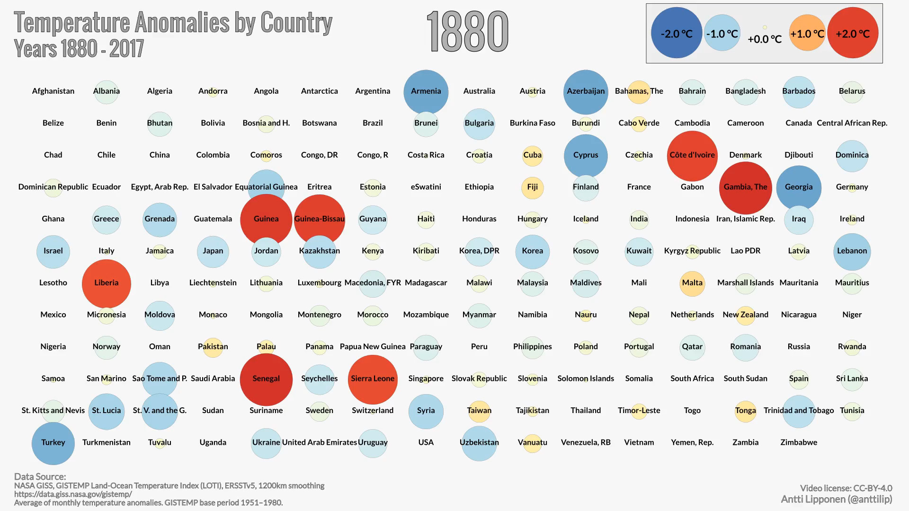
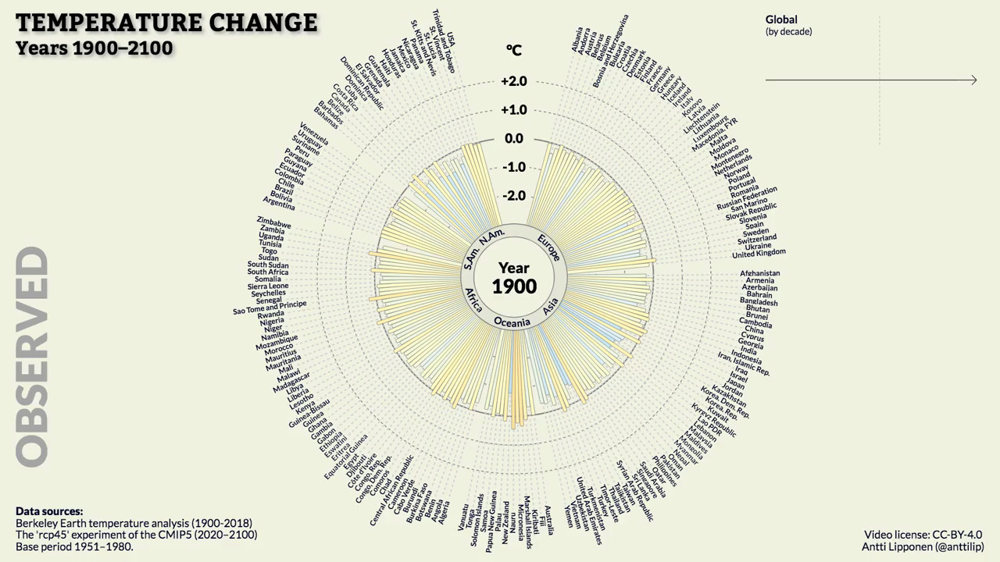

---
jupyter:
  jupytext:
    text_representation:
      extension: .md
      format_name: markdown
      format_version: '1.2'
      jupytext_version: 1.6.0
  kernelspec:
    display_name: Python 3
    language: python
    name: python3
---

# Motivation

The goal of the first part of this book is to learn to program in Python. However, in addition to learning to program, we hope to help you learn a number of other skills related to open science. These include:

1. Writing programs that are easy to understand and share
2. Keeping a log of the changes you make to your programs
3. Creating programs that ensure your science is reproducible
4. Producing simple, effective data visualizations that make your results accessible and easy to understand

To help clarify our goals, consider the example below.


## Effective data visualization

One of the things we will learn in this part of the book is how to use Python to plot data. As you well know, the raw data alone are often not particularly useful in helping you understand what the data show. Let's look at an example that might be familiar to you, global temperature data. The first ten lines of a climate data file can be found below.

```
USAF  WBAN YR--MODAHRMN DIR SPD GUS CLG SKC L M H  VSB MW MW MW MW AW AW AW AW W TEMP DEWP    SLP   ALT    STP MAX MIN PCP01 PCP06 PCP24 PCPXX SD
029740 99999 195201010000 200  23 ***  15 OVC 7 2 *  5.0 63 ** ** ** ** ** ** ** 6   36   32  989.2 ***** ****** *** *** ***** ***** ***** ***** **
029740 99999 195201010600 220  18 ***   8 OVC 7 2 *  2.2 63 ** ** ** ** ** ** ** 6   37   37  985.9 ***** ****** ***  34 ***** ***** ***** ***** **
029740 99999 195201011200 220  21 ***   5 OVC 7 * *  3.8 59 ** ** ** ** ** ** ** 5   39   36  988.1 ***** ****** *** *** ***** ***** ***** ***** **
029740 99999 195201011800 250  16 *** 722 CLR 0 0 0 12.5 02 ** ** ** ** ** ** ** 5   36   27  991.9 ***** ******  39 *** ***** ***** ***** ***** **
029740 99999 195201020000 220   7 *** 722 CLR 0 0 0 12.5 02 ** ** ** ** ** ** ** 0   36   28  995.8 ***** ****** *** *** ***** ***** ***** ***** **
029740 99999 195201020600 220  16 ***  15 OVC 5 * *  9.4 02 ** ** ** ** ** ** ** 1   36   34  997.1 ***** ****** ***  34 ***** ***** ***** ***** **
029740 99999 195201021200 110  14 ***   8 OVC 5 * * 12.5 70 ** ** ** ** ** ** ** 2   34   28  993.1 ***** ****** *** *** ***** ***** ***** ***** **
029740 99999 195201021800 160  14 ***   8 OVC 7 * *  1.2 73 ** ** ** ** ** ** ** 7   34   32  985.9 ***** ******  37 *** ***** ***** ***** ***** **
029740 99999 195201030000 180  18 ***  15 OVC 5 * *  3.8 26 ** ** ** ** ** ** ** 7   36   28  985.4 ***** ****** *** *** ***** ***** ***** ***** **
029740 99999 195201030600 200  14 ***  15 BKN 5 * *  5.0 02 ** ** ** ** ** ** ** 7   36   32  985.2 ***** ****** ***  32 ***** ***** ***** ***** **
...
```

Not that exciting, right? There is an interesting story here, but we need some way to illustrate the power of this data.


One option is to use an *x*-*y* plot of temperature anomalies versus time.


**Figure 1.1**. Global mean temperature anomalies from 1880-2011. Source: <https://www.ncdc.noaa.gov/sotc/global/201113>.

This is obviously much better, nicely showing how temperatures have changed with time and how global temperatures have increased significantly since 1970. Now we have taken a clear step toward making the data easier to understand. However, these are global data and we are missing something important about them, their connection to geographical locations.


Let's consider another option, plotting temperature anomalies on a map.


**Figure 1.2**. Global temperature anomalies for January 2020. Source: <https://www.ncdc.noaa.gov/sotc/global/201603>.

And yet again, this helps us understand the data further. Not only do we see the changes in temperature, but now we see how temperatures vary in space across the globe. The drawback here is that we only see a single time snapshot, rather than a time series. Seeing both will require a truly remarkable visualization.

So, let's look now at some excellent examples of data visualization with Python. We have essentially the same data plotted above, but now we can see how temperatures vary in space and time.


[](https://flic.kr/p/293M1oa)

**Figure 1.3**. Global temperature anomalies by country from 1900-2017. Visualization by Antti Lipponen ([@anttilip](https://twitter.com/anttilip) [^antti_twitter]). The animation can be viewed by clicking on the image or online at <https://flic.kr/p/293M1oa>.

This animated "pill packet" plot of temperature anomalies conveys a huge amount of information in a simple form. People can immediately understand what is plotted, and the combination of the plot format, colors and animation are very effective. What even better is the fact that this animation was made using Python!

Another example shows similar data in a different format, including a peek into the future.


[](https://flic.kr/p/QYnKre)

**Figure 1.4**. Global temperature anomalies past and future, 1900-2100. Visualization by Antti Lipponen ([@anttilip](https://twitter.com/anttilip) [^antti_twitter]). The animation can be viewed by clicking on the image or online at <https://flic.kr/p/QYnKre>.

This plot nicely conveys the warming of different regions on Earth, again in an intuitive format.

For the rest of the first part of this book, plots like those above can be our inspiration. In fact, we will be working with similar data throughout this part of the book and may even end up producing similar plots in by the end Part 1.


## Footnotes

[^antti_twitter]: <https://twitter.com/anttilip>
