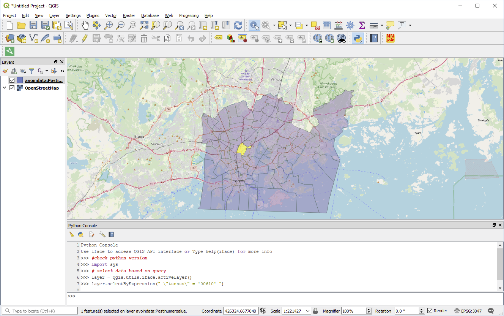

---
jupyter:
  jupytext:
    text_representation:
      extension: .md
      format_name: markdown
      format_version: '1.2'
      jupytext_version: 1.6.0
  kernelspec:
    display_name: Python 3
    language: python
    name: python3
---

# Introduction

We start this first chapter with a short introduction to computers and programs. If you have previous experience programming, or would prefer to jump ahead to the first section on Python programming. Otherwise, the goal here is to ensure you have a good foundation and understanding of essential general topics before introducing computer programming using the Python programming language.

## Why learn to program?

You might be wondering about why you should even bother learning to program at all. Most likely you are not a computer scientist after all, but **neither are we**. Yet all of the authors of this book have developed their basic computer programming skills to be able to write and use simple programs. Even very short computer programs can be very useful!

So, why bother? Well, the fields of geoscience and geography are becoming increasingly quantitative. In both fields we are now processing larger datasets, using numerical models, and performing other quantitative tasks that benefit from having some basic programming skills. Even these basic skills ca allow you to do more in exploring, manipulating, and analyzing your data. For example, many software packages used for data visualization or GIS now include the possibility to include your own Python scripts within the programs to extend what they can do.

**Figure 5**. Using the Python console to interact with GIS data in the QGIS program [^qgis].

Programming can also be fun! Once you learn the basic syntax you may enjoy finding ways to break complex problems down into simpler pieces, developing strategies for solving programming problems, and texting your solutions. This is part of the reason that children are being introduced to programming ideas in books such as the Hello Ruby series {cite}`Liukas2015`. Coming up with solutions with simple programs can be exiting and rewarding, and you can test your solutions right away to see whether or not your solution works!

Moreover, programming can help make us better scientists. The scientific method [^sci_method] is fundamental to how scientists conduct their research. It includes defining questions, gathering information, formulating and testing a hypothesis, analyzing experimental data, interpreting data and drawing conclusions, publishing results, and retesting. Learning basic programming skills can help us with many of these steps. Collecting data, performing experiments, and analyzing data can all be made more efficient using simple programs. For example, we will see how to take take multiple daily temperature observations and use them to calculate monthly average temperatures to investigate wamring trends in the monthly data as part of Chapter 2 in this text. In addition, we will introduce several good programming practices in the first part of this book that will help ensure our experiments and analyses are reproducible, which is a key aspect of open science [^open_sci].

Before we move into introducing programming concepts and the Python language, we will spend the remainder of this chapter with some basic terminology related to computing.

<!-- #region -->
## What is a computer?

## What is a program?

## What is a programming language?

<!-- #endregion -->

## Footnotes

[^open_sci]: <https://en.wikipedia.org/wiki/Open_science>
[^qgis]: <https://www.qgis.org/>
[^sci_method]: <https://en.wikipedia.org/wiki/Scientific_method>
